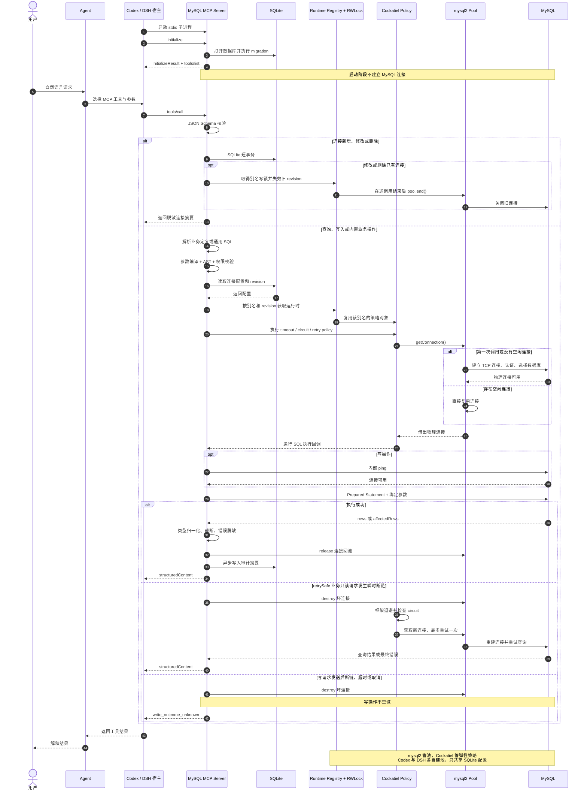

# MySQL Agent Plugin 协议与运行时设计

状态：基础能力与工作空间 Trace 已实现并通过本地验证
更新日期：2026-09-15

## 1. 设计结论

第一版使用本地 stdio MCP。Codex 和 DSH 分别启动一个 MCP Server 子进程，不增加本地 HTTP 服务。

连接池等待、读重试、AST 校验和写入影响行数限制已经合并[速度与稳定性架构评审](speed-stability-review.md)的结论；本文件描述第一版实际协议与运行时行为。

运行时遵守以下规则：

1. 插件启动时打开 SQLite、执行 migration、注册工具，不连接 MySQL。
2. `connection_add` 和 `connection_update` 只保存配置，不主动测试连接。
3. 第一次真实 SQL、Schema 或业务工具调用才创建对应别名的连接池并建立物理连接。
4. 同一 MCP Server 进程内，相同连接别名共享连接池；Codex 与 DSH 的两个进程不共享物理连接。
5. 每次调用都是无会话状态的。调用不能依赖上一次调用使用的物理连接、临时表、用户变量或事务。
6. 通用查询发送后不自动重试；固定 Schema 元数据读取和声明 `retrySafe: true` 的只读业务 SQL 可以在明确瞬时断链后换连接重试一次。写操作发送后绝不自动重试。
7. 配置更新后，新调用立即使用新连接池；旧池只等待正在执行的调用结束。
8. `mysql2` 负责连接池；`cockatiel` 负责重试、退避、熔断和超时。插件不实现这些基础算法。

## 2. MCP 协议

### 2.1 传输

- 传输方式：stdio。
- 编码：UTF-8 JSON-RPC 2.0。
- `stdin`：宿主发给 MCP Server 的协议消息。
- `stdout`：MCP 协议消息专用，禁止输出普通日志。
- `stderr`：结构化运行日志，必须脱敏。
- MCP 协议版本由 SDK 在 `initialize` 阶段协商，不在业务代码里写死。

### 2.2 生命周期

一次 MCP 进程会经历以下阶段：

```text
宿主启动子进程
  -> initialize
  -> InitializeResult
  -> notifications/initialized
  -> tools/list
  -> tools/call（重复多次）
  -> stdin 关闭或进程信号
  -> 优雅关闭
```

Server 第一版支持：

- `initialize`：协商版本并记录 `clientInfo`，审计中将其归一为 `codex`、`dsh` 或 `unknown`。
- `notifications/initialized`：进入可调用状态。
- `tools/list`：返回固定基础工具和当前版本内置的业务工具。
- `tools/call`：执行连接管理、通用 SQL 或业务操作。
- `ping`：只检查 MCP 进程是否存活，不检查 MySQL。
- `notifications/cancelled`：尽力取消当前调用；取消已发送的写操作时返回结果未知语义。

第一版业务工具随插件版本发布，运行期间不动态增删，因此不发送 `notifications/tools/list_changed`。

### 2.3 工具调用消息

宿主调用工具时发送：

```json
{
  "jsonrpc": "2.0",
  "id": 17,
  "method": "tools/call",
  "params": {
    "name": "sql_query",
    "arguments": {
      "connection": "auto-fat",
      "sql": "SELECT id, status FROM orders WHERE order_no = :orderNo",
      "parameters": {
        "orderNo": "A202608260001"
      },
      "max_rows": 100
    }
  }
}
```

Server 同时返回模型可见文本和结构化结果。文本包含摘要及同一份有界 JSON 数据，因为 DSH Native 会把 `content` 交给模型，而 `structuredContent` 主要保留给程序化调用方。查询的模型可见 JSON 上限为 45,000 字符；超过时只截断 `content` 中的行，并保留完整的有界 `structuredContent`：

```json
{
  "jsonrpc": "2.0",
  "id": 17,
  "result": {
    "content": [
      {
        "type": "text",
        "text": "查询成功，返回 1 行，耗时 18 ms。\n{\"schema_version\":\"mysql-agent/result/1\",\"status\":\"ok\",\"kind\":\"query\",\"connection\":\"auto-fat\",\"database\":\"auto_server_fat\",\"rows\":[{\"id\":\"9007199254740993\",\"status\":\"CREATED\"}],\"row_count\":1,\"truncated\":false,\"duration_ms\":18}"
      }
    ],
    "structuredContent": {
      "schema_version": "mysql-agent/result/1",
      "execution_id": "019d2f3d-6c39-7ad4-99aa-4a5e8dd39c3a",
      "status": "ok",
      "kind": "query",
      "connection": "auto-fat",
      "database": "auto_server_fat",
      "rows": [
        {
          "id": "9007199254740993",
          "status": "CREATED"
        }
      ],
      "row_count": 1,
      "truncated": false,
      "duration_ms": 18
    },
    "isError": false
  }
}
```

MySQL、参数、权限和超时错误属于工具执行结果，使用 `isError: true` 返回，方便 Agent 读取并纠正。只有未知工具、非法 JSON-RPC 或 MCP Server 内部协议故障使用 JSON-RPC protocol error。

## 3. 通用字段类型

### 3.1 命名规则

| 字段 | 约束 |
| --- | --- |
| `alias` / `connection` | `^[a-z][a-z0-9_-]{0,63}$` |
| `business_operation_id` | `^[a-z][a-z0-9_.-]{0,127}$` |
| `host` | 1–253 个字符，域名、IPv4 或 IPv6 |
| `database` | 1–64 个字符 |
| `username` | 1–128 个字符 |
| `password` | 0–1024 个字符，允许测试库使用空密码 |
| `description` | 最多 256 个字符 |
| `sql` | 1–65536 字节，只允许一条语句 |

### 3.2 SQL 参数

通用 SQL 使用命名参数：

```sql
SELECT * FROM orders WHERE order_no = :orderNo
```

```json
{
  "orderNo": "A202608260001"
}
```

参数值支持：

- `string`
- 有限 JSON `number`
- `boolean`
- `null`
- 以上类型组成的一维数组

参数名使用 `^[A-Za-z_][A-Za-z0-9_]{0,63}$`。单次调用最多 200 个命名参数，单个列表最多 100 项。占位符发现与参数编译共享同一个词法扫描器，因此单/双引号、反引号、转义引号以及 `#`、`--`、块注释中的冒号文本不会被当作参数。64 位整数必须使用十进制字符串。日期时间作为字符串传递，插件不猜测时区；业务工具通过自己的 schema 规定具体格式。第一版不接受二进制参数和嵌套对象。

普通占位符使用 `:name`。列表使用 `:...name`：

```sql
SELECT * FROM orders WHERE id IN (:...ids)
```

```json
{
  "ids": ["9007199254740993", "9007199254740994"]
}
```

插件先用 SQL lexer 将命名参数编译为 `?` 和有序参数数组，再把原始结构交给 MySQL AST parser 做只读校验，最后调用 `mysql2.execute()`。进入 AST 前，同一个 lexer 会拒绝正常 SQL 代码中的 MySQL `/*!...*/` 和 MariaDB `/*M!...*/` 可执行注释并返回 `EXECUTABLE_COMMENT_FORBIDDEN`；字符串、反引号或行注释中的相同文本不误报。SQL 文本还会无条件拒绝未紧跟 `\n` 的单独 `\r` 并返回 `BARE_CARRIAGE_RETURN_FORBIDDEN`，避免 MySQL 与 parser 对行注释结束位置理解不同；标准 CRLF 保持允许。Parser 不重写 SQL；根 `SELECT` 必须显式包含不超过 `max_rows` 的字面量 `LIMIT`。空数组、未使用参数、缺失参数、重复列表展开或在字符串字面量中伪造占位符都会被拒绝。Parser 无法识别的语法按失败关闭处理，不回退到正则后直接执行。

参数只能替代值，不能替代表名、字段名、数据库名、排序方向或 SQL 关键字。

## 4. 对外工具参数

所有 `inputSchema` 都设置 `additionalProperties: false`。Agent 不能传递未声明字段。

### 4.1 `connection_add`

新增连接配置，只写 SQLite，不连接 MySQL。

| 参数 | 类型 | 必填 | 默认值 | 说明 |
| --- | --- | --- | --- | --- |
| `alias` | string | 是 | - | 连接别名 |
| `datasource_id` | string | 否 | `alias` | 稳定的数据源标识；格式与 `alias` 相同 |
| `environment` | enum | 否 | `custom` | `dev`、`test`、`staging`、`prod` 或 `custom`；不根据 alias 推断 |
| `owner_scope` | string | 否 | `global` | 数据源所有者范围 |
| `shareable` | boolean | 否 | `false` | 是否允许后续工作区共享；当前版本只保存元数据 |
| `description` | string | 否 | `null` | 给 Agent 看的用途说明 |
| `host` | string | 是 | - | MySQL 地址 |
| `port` | integer | 否 | `3306` | 1–65535 |
| `username` | string | 是 | - | MySQL 用户名 |
| `password` | string | 是 | - | 明文写入 SQLite，永不回显 |
| `database` | string | 是 | - | 默认数据库 |
| `allowed_databases` | string[] | 否 | `[database]` | 允许访问的数据库，必须包含默认数据库 |
| `charset` | string | 否 | `utf8mb4` | 第一版只接受 `utf8mb4` |
| `access_mode` | enum | 否 | `read_write` | `read_only` 或 `read_write` |
| `connect_timeout_ms` | integer | 否 | `5000` | 1000–30000 |
| `query_timeout_ms` | integer | 否 | `30000` | 100–300000 |
| `pool_max` | integer | 否 | `2` | 1–2；每个 MCP 进程内、每个数据源最多 2 条物理连接 |
| `idle_timeout_ms` | integer | 否 | `60000` | 10000–600000 |
| `enabled` | boolean | 否 | `true` | 是否允许调用 |

别名已存在时返回 `argument_error`，不执行覆盖。

### 4.2 `connection_update`

修改连接配置。

`alias` 必填，其余字段与 `connection_add` 相同且全部可选。调用至少包含一个待修改字段。成功后 SQLite 中的 `revision` 加一，当前进程立即使旧连接池进入 draining 状态。

密码字段缺省表示保持不变；传空字符串表示把密码修改为空字符串。

### 4.3 `connection_list`

| 参数 | 类型 | 必填 | 默认值 | 说明 |
| --- | --- | --- | --- | --- |
| `include_disabled` | boolean | 否 | `true` | 是否返回停用连接 |

返回字段：`alias`、`datasourceId`、`environment`、`ownerScope`、`shareable`、`description`、`host`、`port`、`username`、`database`、`allowedDatabases`、`accessMode`、超时、池大小、`enabled`、`revision` 和时间戳。永不返回密码。

### 4.4 `connection_remove`

| 参数 | 类型 | 必填 | 说明 |
| --- | --- | --- | --- |
| `alias` | string | 是 | 要删除的连接别名 |

Server 先在 SQLite 短事务中删除配置，再阻止新调用借用该别名的连接。正在执行的调用可在自身超时内结束；当前进程随后关闭旧池。其他 MCP Server 进程在下一次调用时发现配置不存在并关闭自己的池。

### 4.5 `sql_query`

| 参数 | 类型 | 必填 | 默认值 | 说明 |
| --- | --- | --- | --- | --- |
| `connection` | string | 是 | - | 连接别名 |
| `sql` | string | 是 | - | 单条只读 SQL |
| `parameters` | object | 否 | `{}` | 命名参数 |
| `max_rows` | integer | 否 | `1000` | 1–1000；不能超过服务端上限 |
| `timeout_ms` | integer | 否 | 连接默认值 | 100–连接配置上限 |

允许的根语句：`SELECT`、`SHOW`、`DESCRIBE`、`DESC` 和 `EXPLAIN`。`WITH` 必须解析到只读根语句。`SHOW` 只允许查看目标连接允许数据库内的表、字段、索引和状态，不开放 `SHOW DATABASES`。禁止 `SELECT ... INTO OUTFILE`、锁定读、存储过程调用和多语句。

插件通过 AST 确认根 `SELECT` 已包含不超过 `max_rows` 的字面量 `LIMIT`，但不注入、收紧或重新生成 SQL。最终 `structuredContent`（固定执行信封、完整列元数据和行）受 1 MiB 序列化体积限制；超出时用二分前缀保留能容纳的行，更新 `row_count` 并标记 `truncated: true`。若仅固定信封与列元数据已经超限，则返回 `QUERY_RESULT_METADATA_LIMIT`，不交付超限结构。MCP 文本副本另受 45,000 字符限制，会同时裁剪列和行；`structuredContent` 始终是结果真值。

### 4.5.1 `schema_search`

| 参数 | 类型 | 必填 | 默认值 | 说明 |
| --- | --- | --- | --- | --- |
| `connection` | string | 是 | - | 连接别名 |
| `keyword` | string | 否 | - | 搜索表名/注释和列名/注释 |
| `limit` | integer | 否 | `20` | 1–50 个匹配表 |
| `refresh` | boolean | 否 | `false` | 为 `true` 时跳过 L1/L2 缓存并从 MySQL 重新加载 |

返回 `database/name/type/comment/matched_columns`，按确定性相关度排序。它不接收 SQL，只搜索连接的数据库白名单。

### 4.5.2 `schema_describe`

| 参数 | 类型 | 必填 | 默认值 | 说明 |
| --- | --- | --- | --- | --- |
| `connection` | string | 是 | - | 连接别名 |
| `tables` | string[] | 是 | - | 1–20 个 `table` 或 `allowed_database.table` |
| `include_relations` | boolean | 否 | `true` | 是否返回及展开关系 |
| `relation_depth` | integer | 否 | `1` | 0–2 层相关子图 |
| `include_inferred_relations` | boolean | 否 | `false` | 是否加入保守推断关系 |
| `refresh` | boolean | 否 | `false` | 为 `true` 时跳过 L1/L2 缓存并从 MySQL 重新加载 |

表结果包含列类型、主键、可空、默认值、注释和索引，不包含密码或 DDL。声明外键为 `source: "foreign_key"`；推断关系为 `source: "inferred"`，并携带置信度和理由。

完整结构化描述结果上限为 1 MiB；超过时返回 `SCHEMA_DESCRIBE_RESULT_LIMIT`，要求减少 `tables` 或 `relation_depth`，不会静默丢弃显式请求表。

### 4.6 `sql_execute`

| 参数 | 类型 | 必填 | 默认值 | 说明 |
| --- | --- | --- | --- | --- |
| `connection` | string | 是 | - | 连接别名 |
| `sql` | string | 是 | - | 单条写 SQL |
| `parameters` | object | 否 | `{}` | 命名参数 |
| `timeout_ms` | integer | 否 | 连接默认值 | 100–连接配置上限 |

只接受 `INSERT`、`UPDATE` 或 `DELETE`。`UPDATE` 和 `DELETE` 必须有有效 `WHERE`，不提供由 Agent 设置的绕过参数。第一版禁止 DDL、`REPLACE`、`TRUNCATE`、`LOAD DATA`、存储过程和多语句。

`read_only` 连接拒绝这个工具。

### 4.7 `history_search`

搜索本地 `state.db` 中的 SQL 审计摘要，可按 `execution_id`、`connection`、`business_operation_id`、`client_name`、`statement_kind`、`status`、`since` 和 `until` 过滤。`limit` 为 1–100；结果有下一页时返回 `next_before_id`，后续调用传给 `before_id`。

历史记录包含时间、数据源、SQL 类型、SQL hash、耗时、行数、影响行数、重试次数、状态、错误分类，以及业务操作对应的包 ID、版本和操作 hash。记录不含绑定参数值、完整 SQL或查询结果，`result_replayable` 固定为 `false`。需要当前数据时重新执行查询。

### 4.8 `list_business_operations`

| 参数 | 类型 | 必填 | 默认值 | 说明 |
| --- | --- | --- | --- | --- |
| `connection` | string | 是 | - | 先限定固定业务操作所属数据源 |
| `domain` | string | 否 | - | 按业务域过滤，最多 64 个字符 |
| `keyword` | string | 否 | - | 搜索标题、描述和使用场景，最多 128 个字符 |
| `mode` | enum | 否 | - | `read`、`insert`、`update` 或 `delete` |
| `limit` | integer | 否 | `50` | 1–100 |

返回业务操作的 ID、标题、描述、使用场景、模式、目标连接、输入 schema、业务包 ID、版本和操作 hash，不返回 SQL 文本。

业务目录先按 `connection` 过滤，再应用 domain、keyword、mode 和 limit。域聚合也按“connection + domain + read/write”隔离，避免不同数据源的固定操作混入同一入口。

### 4.9 `business__<connection>__<domain>__read|write`

业务操作默认按固定数据源、业务域和读写通道生成分组工具。输入使用 `{ operation, input }`；`operation` 只能选择该分组已注册的操作，`input` 由对应操作的 Zod schema 校验。模型不接收 `connection`、`sql` 或任意 `parameters` 对象。

```json
{
  "operation": "trace_by_waybill_no",
  "input": { "waybill_no": "KY-20260826-001" }
}
```

Registry 启动时要求每个 SQL 占位符对应一个必填属性：普通占位符只能使用字符串、安全整数、布尔值或显式 `null`，展开占位符只能使用 1–100 项的一维标量数组；可选值、嵌套对象、对象数组、默认值、coercion、transform 和标量/列表错配会使启动失败。解析后的参数在编译 SQL 前还会再次按 `SqlParameters` 运行时边界校验。显式设置 `exposure: 'direct'` 时，生成 `business__<connection>__<domain>__<name>` 独立工具。

业务 direct 与“数据源 + 业务域 + 读写通道”聚合入口生成最终工具名后，按 MCP 字符规则校验且最长 128 个字符；非法或过长名称在注册 Server 前作为配置错误拒绝。

### 4.10 工作空间 Trace 与统计

`workspace` 模式下，`sql_query*`、`sql_execute*`、`schema_search*`、`schema_describe*` 和固定 SQL 业务工具每次调用创建一条 `execution_runs` 根记录和一条 root span。成功和错误结果都返回 `trace_id` 与 UUIDv7 `run_id`。真实 SQL 的 `execution_audit` 继承当前 `run_id`、`trace_id` 和 `span_id`；后续脚本内部调用使用 `TraceRecorder.startChild()` 继承同一个 trace，不创建第二条 root。

### Discovery 与业务包重载

工作空间可显式配置 `discovery.enabled: true` 和 1 至 90 天的 `retention_days`。默认关闭。开启后只有该工作空间的通用 `sql_query*` / `sql_execute*` 进入候选采样；固定业务 SQL 和脚本继续由 usage 统计，不重复进入 discovery。采样只保存工作空间、逻辑数据源、环境、语句类型、经过注释和字面量消除后的 SHA-256 指纹、参数名称/类型/列表形状、解析器已验证的表名、耗时、结果字节数、状态和相邻序列提示。它不保存 SQL/归一化模板、参数值、结果、物理 alias 或凭据。`business_candidate_analyze` 强制限定当前工作空间，返回聚合候选及已发布 SQL/script usage 对照。

`workspace_business_reload` 是显式、安全的业务包热重载入口。它串行重新读取当前 `business_pack_paths`，在独立 registry 中完成 YAML、路径、SQL、依赖、工具名、输入 schema 和 QuickJS 语法校验；只有全部成功才切换 generation。业务调用先 acquire generation，完成后 release，因此在途请求可继续使用旧 registry，旧 generation 在引用归零后关闭。工具新增/删除通过 MCP 注册句柄同步并发出 list-changed；同名输入 schema 变化会拒绝本次重载，避免客户端按旧 schema 调用。重载失败保留 last-known-good，`workspace_validate` 返回当前 generation 和最近一次脱敏重载事件。

Trace 根记录创建失败不会阻断业务 handler。此时结果明确返回 `telemetry_persisted: false`、`trace_id: null` 和 `run_id: null`，不会伪造一个未落库的 Trace。Trace 结束更新对 SQLite busy/locked 做最多三次即时有界重试；最终失败只写脱敏告警并返回原业务结果，同时把 `telemetry_persisted` 标记为 `false`。

`trace_search` 只检索当前 descriptor 的 `workspace_id`，支持按 trace、run、operation、kind、status、逻辑数据源、环境和时间过滤。返回 root 与 child span 摘要，但不返回物理连接 alias。`usage_summary` 在同一隔离边界内统计 count、error_count、p50/p95/p99、平均耗时和结果字节数，可按 operation、kind、datasource、environment 或 status 分组。

Trace 分页使用返回的不可见实现细节游标 `next_cursor`，下一页原样传入 `cursor`。游标同时携带 `started_at + run_id`，因此同一毫秒内存在多条根调用时不会漏项；旧的 `before_started_at` 仍保留为兼容入口。只有通过 MCP 工具输入 Schema 校验并进入 handler 的调用才生成 `execution_run`；SDK 在 handler 之前拒绝的协议级 validation error 由宿主记录，不通过放宽工具 Schema 来伪造 application execution。

Trace 表只保存标识、逻辑目标、版本/hash、耗时、排队时间、状态和有界结果字节数，不保存参数值、SQL 全文、查询结果、密码或凭据。workspace 启动时先把当前 workspace 中开始超过一小时仍未结束的记录收敛为 `error/abandoned`，再按 `audit_retention_days` 清理该 workspace 已结束且 `ended_at` 早于截止时间的 run/span；正在运行的记录绝不由 retention 直接删除，SQLite 外键级联也不触碰其他 workspace。详细导出仍为后续能力，清理前的导出与 hash 校验由调用方负责。

```json
{
  "order_no": "A202608260001"
}
```

业务工具固定目标连接、SQL、超时、最大行数和操作模式。`read_only` 连接仍会拒绝写模式业务工具。

## 5. 工具 annotations

| 工具 | `readOnlyHint` | `destructiveHint` | 说明 |
| --- | --- | --- | --- |
| `connection_list` | `true` | - | 只读取本地配置 |
| `connection_add` | `false` | `false` | 新增本地配置 |
| `connection_update` | `false` | `true` | 会替换连接配置并关闭旧池 |
| `connection_remove` | `false` | `true` | 删除本地配置 |
| `history_search` | `true` | - | 只读取本地审计摘要，不访问 MySQL |
| `sql_query` | `true` | - | 只读数据库 |
| `schema_search` / `schema_describe` | `true` | - | 只读固定元数据查询 |
| `sql_execute` | `false` | `true` | 可能修改或删除数据 |
| `list_business_operations` | `true` | - | 只读工具目录 |
| 内置业务工具 | 按 `mode` | 按 `mode` | `insert` 为新增；`update/delete` 为破坏性 |

annotations 只向宿主描述风险，服务端仍执行确定性校验。

## 6. 统一返回契约

### 6.1 公共字段

```json
{
  "schema_version": "mysql-agent/result/1",
  "execution_id": "UUIDv7",
  "status": "ok",
  "kind": "query",
  "connection": "auto-fat",
  "database": "auto_server_fat",
  "business_operation_id": null,
  "duration_ms": 18
}
```

`execution_id` 由插件生成，用于日志和审计关联，不复用宿主提供的 JSON-RPC `id`。

Schema 成功结果同样使用 `mysql-agent/result/1`，并额外返回 `connection_revision`、`allowed_databases` 与 `cache: { source, loaded_at }`。`source` 是 `memory`、`sqlite` 或 `mysql`；`duration_ms` 包含缓存查找或实时元数据加载。

### 6.1.1 Schema 缓存与失效

Schema 调用首次懒加载：L1 进程内快照约 5 分钟，L2 SQLite 快照约 30 分钟。读取 L2 时先按原始 UTF-8 JSON 字节数执行 16 MiB 上限，再解析并执行与 MySQL loader 输出相同的嵌套结构和规范化序列化大小校验；不可信或超限记录按 miss 处理并尽力删除。缓存键覆盖连接别名、revision、默认库和数据库白名单；同进程并发 miss 合并成一次加载。显式传入 `refresh: true` 会使该 alias/revision 的 L1/L2 快照失效，绕过持久化缓存从 MySQL 重新加载，并用新快照覆盖缓存；返回的 `cache.source` 为 `mysql`。`schema_describe` 在缓存中找不到已允许的请求表时，也会使该 alias/revision 快照失效并绕过缓存加载一次； fresh MySQL 结果仍不存在时直接返回 `SCHEMA_TABLE_NOT_FOUND`，不循环刷新。更新/删除连接和安全识别到的未知表/列错误也会清理相关快照。写请求即使触发失效也绝不因此自动重试。

共享 Schema 加载不归属于某一个等待者。每个 MCP 调用分别监听自己的取消信号：取消的等待者立即得到 `REQUEST_CANCELLED`；还有其他等待者时，共享加载继续且成功后填充缓存；最后一个等待者也取消时，内部 controller 才取消 `ConnectionRuntime` 和元数据执行，并让下一次调用建立新的共享加载。

连接管理成功结果使用 `kind: "connection"` 和 `action: "add" | "update" | "list" | "remove"`。新增和修改返回单个脱敏连接摘要，列表返回摘要数组，删除只返回别名和删除结果。所有连接摘要都排除密码。

### 6.2 查询成功

```json
{
  "status": "ok",
  "kind": "query",
  "columns": [
    {
      "name": "id",
      "database_type": "BIGINT"
    }
  ],
  "rows": [],
  "row_count": 0,
  "truncated": false,
  "duration_ms": 18
}
```

BIGINT、DECIMAL 等不能安全表示为 JSON number 的值统一返回字符串。连接启用 `dateStrings`，`DATE`、`DATETIME` 和 `TIMESTAMP` 保留 MySQL 字符串形式，不擅自附加时区。二进制值默认返回 Base64 字符串并标记列类型。

### 6.3 写入成功

```json
{
  "status": "ok",
  "kind": "execute",
  "operation": "update",
  "affected_rows": 1,
  "changed_rows": 1,
  "last_insert_id": null,
  "warning_count": 0,
  "duration_ms": 12
}
```

`last_insert_id` 有值时使用十进制字符串。

### 6.4 错误

```json
{
  "schema_version": "mysql-agent/result/1",
  "execution_id": "019d2f3d-6c39-7ad4-99aa-4a5e8dd39c3a",
  "status": "error",
  "category": "connection_error",
  "code": "MYSQL_CONNECTION_LOST",
  "message": "连接 auto-fat 已断开，本次查询未完成。",
  "connection": "auto-fat",
  "retryable": true,
  "write_outcome": "not_applicable",
  "retry_after_ms": 250,
  "attempt_count": 2,
  "mysql_code": null,
  "mysql_error_name": null,
  "mysql_message": null,
  "sql_state": null
}
```

`write_outcome` 取值：

- `not_applicable`：不是写操作。
- `not_sent`：写 SQL 尚未交给驱动。
- `known_failed`：MySQL 明确返回失败。
- `committed`：MySQL 明确返回成功。
- `unknown`：发送后断链、超时或取消，无法确认是否生效。

`category` 取值：`argument_error`、`config_error`、`connection_error`、`authentication_error`、`timeout`、`sql_error`、`permission_error`、`result_limit`、`write_outcome_unknown` 和 `internal_error`。`code` 是插件定义的稳定代码；`mysql_code`、`mysql_error_name` 和 `sql_state` 只在 MySQL 返回对应信息时出现。`mysql_message` 返回经过单行化、长度限制和参数值脱敏的具体 MySQL 失败原因；MCP 文本正文也携带这组诊断信息，确保不展示 `structuredContent` 的客户端仍能给 Agent 明确原因。

对于 MySQL SQL 错误，顶层 `message` 同样使用具体的脱敏原因，而不是宽泛提示。例如：`Unknown column 'e.deleted' in 'where clause'`。

错误结果不返回密码、完整连接串、绑定参数值或完整 SQL。

## 7. 连接什么时候建立

### 7.1 MCP Server 启动

启动时只执行：

1. 解析业务包目录，并一次性加载、校验全部业务包。
2. 解析 `MYSQL_AGENT_HOME`。
3. 打开 SQLite，设置 WAL 和 `busy_timeout`，执行 schema migration。
4. 创建业务 registry 和空的 MySQL 运行时 registry。
5. 注册 MCP 工具。
6. 等待 `initialize`。

此时没有 MySQL TCP 连接，也不会执行 `SELECT 1`。

### 7.2 新增和修改连接

`connection_add` 只插入 SQLite。`connection_update` 只更新 SQLite、递增 `revision` 并使旧池失效。两者都不会创建 MySQL 物理连接。

### 7.3 第一次真实调用

第一次调用 `sql_query`、`sql_execute` 或业务工具时：

1. 从 SQLite 读取连接配置和 `revision`。
2. 检查连接存在、启用且权限模式允许当前操作。
3. `ConnectionRuntimeRegistry` 按别名取得运行时对象；其中的连接池由 `mysql2` 创建。
4. `pool.getConnection()` 按需建立 TCP 连接、完成 MySQL 握手、认证并选择默认数据库。
5. 获取连接成功后执行当前真实 SQL。

并发到达的第一次调用通过 `@rocicorp/lock` 的 `RWLock.withWrite()` 创建运行时对象：同一别名只调用一次 `mysql2.createPool()`，其余调用由锁排队。这里的注册表只解决别名与配置版本映射，不实现连接池算法。

## 8. 连接如何复用

每个 MCP Server 进程维护：

```text
Map<connectionAlias, RuntimeEntry>

RuntimeEntry:
  lifecycleLock: @rocicorp/lock.RWLock
  current: ConnectionRuntime | undefined

ConnectionRuntime:
  alias
  revision
  pool: mysql2.Pool
  connectionPolicy: cockatiel circuit breaker
  readRetryPolicy: cockatiel retry policy
```

`ConnectionRuntimeRegistry` 是一层薄适配：它解析连接别名、比较 `revision`、创建框架对象并在配置变化时替换对象。它不维护空闲连接、等待队列、退避计时器或熔断状态机。

推荐池参数：

```ts
{
  waitForConnections: false,
  connectionLimit: poolMax,
  maxIdle: Math.min(2, poolMax),
  idleTimeout: idleTimeoutMs,
  queueLimit: 0,
  enableKeepAlive: true,
  keepAliveInitialDelay: 10_000,
  multipleStatements: false,
  dateStrings: true,
  supportBigNumbers: true,
  bigNumberStrings: true,
  decimalNumbers: false
}
```

`poolMax` 默认且最大为 2。连接池按需创建物理连接，启动时不会预建连接；空闲时最多保留 2 条热连接。Cockatiel bulkhead 对同一数据源允许 2 个调用执行、8 个调用排队，排队最多等待 1000 ms。

执行过程：

1. 调用从池中借一条连接。
2. 池优先返回空闲连接；没有空闲连接时，在 `pool_max` 范围内新建物理连接。
3. 达到上限后，后续调用在 Cockatiel bulkhead 中进入有界等待队列；第 11 个并发调用或排队超过 1000 ms 时返回 `busy`。
4. 执行成功后在 `finally` 中释放连接，供后续 Agent 调用复用。
5. 致命连接错误或客户端超时会销毁当前连接，不放回池中。
6. 超过 `idle_timeout_ms` 的空闲连接由池释放；逻辑池继续存在，下一次调用按需重建物理连接。

连接不绑定 Agent。只要调用进入同一个 MCP Server 进程并使用相同别名，就共享池。Codex 与 DSH 各自启动的进程拥有各自的池，只共享 SQLite 配置。

插件不在每次调用前执行 `SELECT 1`。为了降低陈旧连接造成的写入结果未知，每次写操作借到连接后先执行驱动级 `ping()`；只读请求不增加这次往返。

## 9. 配置变化如何生效

`connections` 表增加：

```sql
revision INTEGER NOT NULL DEFAULT 1,
allowed_databases_json TEXT NOT NULL DEFAULT '[]',
idle_timeout_ms INTEGER NOT NULL DEFAULT 60000
```

每次数据库工具调用读取目标连接的轻量配置行，并将 SQLite `revision` 与 `ConnectionRuntime.revision` 比较：

- revision 相同：复用当前池。
- revision 变大：在别名写锁内关闭旧池并替换运行时对象；等待的新调用随后进入新池。
- 配置被删除或停用：拒绝新调用并关闭本地旧池。

配置切换与数据库调用通过每个别名的 `@rocicorp/lock` 异步读写锁协调：调用持有读锁，切换持有写锁。切换会等待在途调用完成，再执行 `pool.end()`；等待仍受进程关闭上限约束。插件不维护 `activeCalls` 计数和自定义排队逻辑。

这个 revision 检查让 Codex 和 DSH 两个进程在不通信的情况下最终使用同一份最新配置。

## 10. 重连策略

插件复用每个连接别名的 Cockatiel policy 对象。Cockatiel 保存 closed、open 和 half-open 状态，计算退避时间，并限制半开探测；插件只提供错误分类函数和参数，不复制状态机实现。policy 的事件回调负责输出脱敏状态日志。

### 10.1 瞬时错误

以下类别按连接错误处理：TCP reset、broken pipe、连接被服务端关闭、服务端重启、网络超时和协议连接丢失。

认证失败、未知数据库、权限不足、SQL 语法错误和参数错误不是瞬时错误，不进入自动重连。

### 10.2 重试规则

| 场景 | 自动动作 |
| --- | --- |
| 获取连接前发生瞬时错误 | 关闭坏连接，短退避后重新获取一次 |
| 通用查询发送后发生瞬时断链 | 销毁连接，不自动重试 |
| 声明 `retry_safe: true` 的业务包只读 SQL 发送后发生瞬时断链 | 销毁连接，换新连接重试一次 |
| 查询执行超时 | 销毁连接，不重试 |
| 写 SQL 尚未发送，获取连接失败 | 可以重新获取一次，`write_outcome=not_sent` |
| 写 SQL 发送后断链、超时或取消 | 不重试，`write_outcome=unknown` |
| MySQL 明确返回写入失败 | 不重试，`write_outcome=known_failed` |

允许重试时只发生在同一次工具调用内部，最多一次。返回结果包含 `attempt_count`。

### 10.3 Cockatiel 退避和熔断配置

- 单次读重连退避：100–300 ms 随机抖动。
- 同一别名连续 3 次瞬时连接失败：Cockatiel 打开 circuit breaker。
- 初始冷却：5 秒；连续失败按 5、10、20、30 秒增长，上限 30 秒。
- 冷却期间直接返回 `connection_error` 和 `retry_after_ms`，避免多个 Agent 同时打满连接超时。
- 冷却结束后，Cockatiel 允许第一个真实调用进入 half-open。插件不额外执行对外可见的测试连接。

只把 TCP reset、broken pipe、服务端关闭连接、网络超时和协议连接丢失交给该 policy。认证、权限、未知数据库、参数和 SQL 错误直接返回，不能触发重试或熔断。

## 11. 超时和取消

插件先计算有效超时，再为本次调用创建 Cockatiel timeout policy：

```text
min(工具传入 timeout_ms, 连接 query_timeout_ms)
```

端到端调用还受宿主工具调用超时限制。DSH 和 Codex 的宿主超时需要设得更长；DSH 示例使用 60 秒，插件默认查询超时使用 30 秒。

为了准确销毁超时连接，SQL 不直接使用 `pool.execute()`；执行器先 `getConnection()`，再在该连接上调用 `execute()`。Cockatiel 发出超时或取消信号时，MySQL 适配器销毁这条物理连接。驱动无法证明写请求是否到达服务端，因此 `SENT` 状态仍由执行器记录。

客户端超时不是 MySQL 事务结果证明。读操作返回 `timeout`；写操作发送后的超时返回 `write_outcome_unknown`。

## 12. 完整执行过程



### 12.1 插件启动

1. Codex 或 DSH 启动 Node.js MCP 子进程。
2. 进程一次性加载并校验固定业务 SQL 包；任一配置错误都会阻止启动。
3. 初始化 SQLite 和 migration。
4. 创建空的 `ConnectionRuntimeRegistry`，此时没有 MySQL 连接。
5. 完成 MCP `initialize` 和工具目录同步。
6. Agent 获得基础工具和业务工具定义。

### 12.2 新增连接

1. 用户用自然语言提供连接信息。
2. Agent 调用 `connection_add`。
3. Server 校验字段并在 SQLite 短事务中插入配置。
4. Server 返回脱敏后的连接摘要。
5. 不连接 MySQL，不执行测试 SQL。

### 12.3 通用查询

1. Agent 选择 `sql_query`，分别提交 SQL 与参数。
2. MCP 层校验 JSON Schema。
3. SQL 层解析 AST，确认单条只读语句、数据库范围和行数规则。
4. 参数编译器生成预处理 SQL 和有序参数数组。
5. 运行时读取连接配置，检查 revision、enabled 和 access mode。
6. `ConnectionRuntimeRegistry` 取得运行时，Cockatiel policy 调用 `mysql2` 池借出连接。
7. 执行器调用 prepared statement。
8. 成功后规范化字段类型、限制行数和字节数。
9. 连接释放回池。
10. Cockatiel bulkhead 串行写入审计摘要；队列已满时丢弃非关键审计并记录计数器。
11. MCP 返回 `content + structuredContent`。

### 12.4 通用写入

1. Agent 选择 `sql_execute`。
2. 支持审批的宿主在发送 `tools/call` 前处理确认。
3. Server 校验参数、单条 DML、`WHERE` 和 `read_write` 权限。
4. 运行时获取连接；陈旧连接在写入前执行内部 `ping()`。
5. 执行器把 SQL 交给驱动，并立即把调用状态记为 `SENT`。
6. MySQL 明确成功时返回影响行数并释放连接。
7. MySQL 明确失败时返回 `known_failed` 并释放或销毁连接。
8. 发送后断链、超时或取消时销毁连接，返回 `unknown`，绝不重试。
9. 审计记录 statement kind、hash、耗时和结果，不记录参数值。

### 12.5 内置业务工具

1. Agent 根据数据源和工具描述选择 `business__<connection>__<domain>__read|write`。
2. Server 先用 `operation` 选择固定操作，再用该操作的 schema 校验 `input`。
3. Registry 提供固定连接、SQL、mode、timeout 和 result mapping。
4. 后续连接和执行过程与通用查询或写入相同。
5. 执行结果和审计额外记录 `business_operation_id`、业务包 ID、版本和操作 hash。

复杂业务操作如需多条写 SQL 原子执行，必须在插件代码中使用同一连接和显式事务实现；通用工具不暴露跨调用事务。

### 12.6 配置更新和删除

1. Agent 调用 `connection_update` 或 `connection_remove`。
2. SQLite 在短事务中修改 revision 或先删除记录。
3. 当前进程立即停止向旧池分配新调用。
4. 其他进程在下一次调用时通过 revision 或记录缺失发现变化。
5. 在途调用结束后关闭旧池。

### 12.7 进程关闭

1. 收到 stdin EOF、`SIGTERM` 或 `SIGINT` 后停止接收新工具调用。
2. 最多等待 5 秒让在途调用结束。
3. 对所有池执行 `pool.end()`。
4. 刷新审计队列并关闭 SQLite。
5. 进程退出。

如果强制退出发生在写操作发送之后，宿主只能看到 MCP 调用中断，不能把它解释为数据库写入失败。

## 13. 多 Agent 并发

- 相同进程、相同连接别名：共享一个连接池。
- 相同进程、不同连接别名：使用不同连接池。
- Codex 进程与 DSH 进程：各自维护连接池，共享 SQLite。
- 同一别名默认且最多建立 2 条物理连接；物理连接按需建立，不在启动时预建。
- Cockatiel bulkhead 最多允许 2 个调用执行、8 个调用排队，防止无限排队。
- SQLite 使用 WAL、`busy_timeout=5000` 和短事务。
- 审计通过 Cockatiel bulkhead 串行写入并限制等待数量；关键配置写入不经过异步队列。

单次调用不保留 session affinity。Agent 不能先执行 `BEGIN`，再指望下一次调用使用同一连接执行 `COMMIT`。

## 14. 日志与审计

`stderr` 日志允许记录：

- `execution_id`
- `client_name`
- 连接别名
- SQL 类型和规范化 hash
- 业务操作 ID
- Cockatiel circuit 状态变化和 mysql2 池生命周期
- 耗时、行数、影响行数
- 错误类别、MySQL code 和 SQL state

禁止记录：

- 密码
- 完整连接串
- 绑定参数值
- 完整 SQL
- 查询返回数据

## 15. 第一版明确不提供

- 独立 `test_connection` 工具。
- 本地 HTTP 管理端。
- 通用 DDL、`TRUNCATE`、`REPLACE` 或存储过程执行。
- 任意多语句执行。
- 跨工具调用事务。
- Agent 可设置的无 `WHERE` 绕过参数。
- 运行时热加载或由 Agent 新增、修改业务 SQL；业务包文件变化只在重启后生效。
- Codex 与 DSH 进程之间共享物理连接。

## 16. 验收用例

至少覆盖：

1. MCP 启动后 MySQL 连接数保持不变。
2. 第一次真实查询才建立连接。
3. 连续查询复用连接，热查询延迟低于冷查询。
4. 并发首次调用只创建一个逻辑池。
5. 空闲超时后物理连接释放，下一次调用自动恢复。
6. `connection_update` 后新调用使用新 revision，旧池完成在途调用后关闭。
7. Codex 与 DSH 同时修改 SQLite 时没有锁错误或配置丢失。
8. 通用读请求发送后断链不重试；`retrySafe` 业务读请求最多重试一次。
9. 写请求发送后断链返回 `write_outcome_unknown`，没有第二次写入。
10. 熔断期间快速失败，冷却后由真实调用恢复。
11. 超时和取消销毁对应物理连接，不污染连接池。
12. 所有工具结果和日志均不泄露密码与参数值。
13. BIGINT、DECIMAL 和日期时间序列化结果稳定。
14. 多语句、跨库、无 `WHERE` 更新和删除全部被拒绝。
15. 对单一数据源发起 60 个并发请求，验证最多 2 个执行、8 个排队，其余 50 个快速返回 `busy`，且物理连接数不超过 2。

## 17. 依据

- MCP 使用 JSON-RPC 2.0，并在 initialize 阶段协商能力和协议版本：<https://modelcontextprotocol.io/specification/2025-11-25>
- MCP stdio 使用 stdin/stdout 传输协议消息，普通日志写 stderr：<https://modelcontextprotocol.io/specification/2025-06-18/basic/transports>
- MCP `tools/call` 使用结构化 arguments；工具错误通过 `isError` 和 `structuredContent` 返回：<https://modelcontextprotocol.io/specification/2025-11-25/schema>
- mysql2 连接池按需创建物理连接并复用空闲连接：<https://github.com/sidorares/node-mysql2/blob/master/website/docs/index.mdx>
- Cockatiel 提供 TypeScript retry、circuit breaker、timeout 和 bulkhead policy：<https://github.com/connor4312/cockatiel/blob/master/readme.md>
- `@rocicorp/lock` 提供异步 `RWLock`，允许并发读取和独占写入：<https://www.npmjs.com/package/@rocicorp/lock>
- MySQL Prepared Statement 将参数值与单条 SQL 分开绑定：<https://dev.mysql.com/doc/c-api/26.7/en/mysql-stmt-prepare.html>
- node-sql-parser 提供 MySQL AST、语句类型和访问表清单：<https://github.com/taozhi8833998/node-sql-parser>
